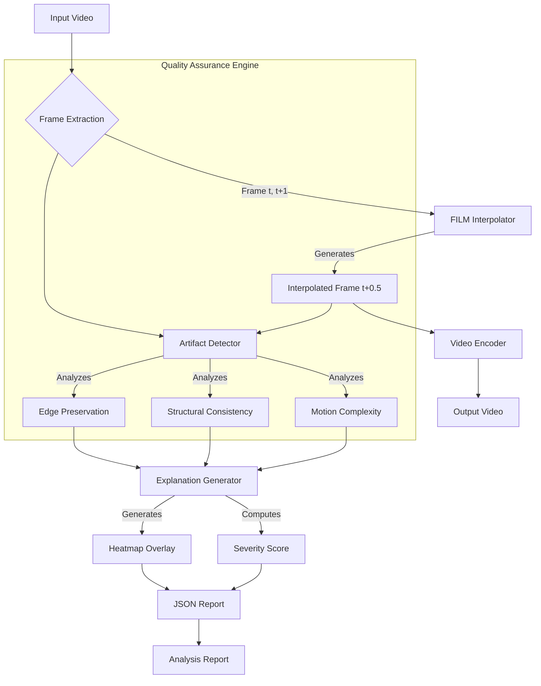

# SyntheSight: Explainable Frame Interpolation Framework

[](https://opensource.org/licenses/MIT)
[](https://www.python.org/downloads/)
[](https://tensorflow.org/)
[](https://github.com/psf/black)

**SyntheSight** is a production-grade research framework designed to bridge the gap between high-performance neural frame interpolation and interpretability. By integrating the **FILM (Frame Interpolation for Large Motion)** model with a novel **Reference-Free Quality Estimation Engine**, SyntheSight allows researchers and video engineers to upscale frame rates while automatically detecting and diagnosing deep learning hallucinations (ghosting, occlusion artifacts) without needing ground-truth data.

---

## 🏗️ System Architecture

SyntheSight operates on a three-stage pipeline: **Interpolation**, **Detection**, and **Explanation**.



---

## 🔬 Key Features

*   **Deep Frame Interpolation**: Leverages Google's FILM model to synthesize intermediate frames with high perceptual quality, effectively doubling the frame rate.
*   **Blind Artifact Detection**: Implements a hybrid metric system using Optical Flow, SSIM, and Canny Edge Detection to identify rendering errors in real-time.
*   **Explainable AI (XAI)**:
    *   **Visual Heatmaps**: Overlays error-prone regions directly onto debug frames.
    *   **Severity Scoring**: Assigns a confidence score to each interpolated frame.
    *   **Natural Language Explanations**: Translates numerical metrics into human-readable diagnostics (e.g., "High occlusion risk detected").
*   **Production Ready**: Features a modular architecture, robust logging via `Rich`, and CLI support for batch processing.

---

## 🚀 Getting Started

### Prerequisites
*   Python 3.8+
*   FFmpeg (for video processing)

### Installation

1.  **Clone the repository**
    ```bash
    git clone https://github.com/arvindkumar1422/Synthesight---A-Frame-Interpolation-and-explanatory-Module.git
    cd Synthesight
    ```

2.  **Install Dependencies**
    ```bash
    pip install -r requirements.txt
    ```

### Usage

Run the main pipeline on your video file:

```bash
python main.py inputs/video.mp4 --output output/smooth.mp4 --report output/report.json
```

**Arguments:**
*   `input_video`: Path to the source video.
*   `-o, --output`: Path for the interpolated video (default: `output.mp4`).
*   `-r, --report`: Path for the JSON analysis report (default: `report.json`).
*   `-c, --config`: Path to custom configuration YAML.

---

## 📊 Methodology

The core innovation of SyntheSight is its **Reference-Free Quality Metric**, defined as:

$$ S_{total} = w_1 \cdot M_c + w_2 \cdot (1 - S_c) + w_3 \cdot |1 - E_r| $$

Where:
*   **$M_c$ (Motion Complexity)**: Average magnitude of optical flow vectors between $I_t$ and $I_{t+1}$. High motion increases the probability of occlusion artifacts.
*   **$S_c$ (Structural Consistency)**: SSIM between the interpolated frame $I_{interp}$ and the linear blend of inputs. Measures deviation from linear motion.
*   **$E_r$ (Edge Preservation Ratio)**: Ratio of edge density in $I_{interp}$ vs. inputs. Detects blurring ($E_r < 1$) or ghosting ($E_r > 1$).

---

## 📂 Project Structure

```
SyntheSight/
├── src/
│   ├── interpolation/   # FILM model wrapper and inference logic
│   ├── detection/       # Computer Vision metrics (Optical Flow, SSIM)
│   ├── explanation/     # Heatmap generation and reporting
│   └── pipeline/        # Orchestrator for video processing
├── main.py              # CLI Entry point
├── config.yaml          # Hyperparameters for detection thresholds
└── requirements.txt     # Python dependencies
```

## 📜 License

This project is licensed under the MIT License.
