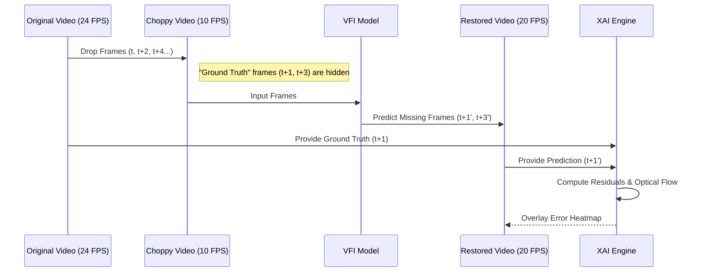
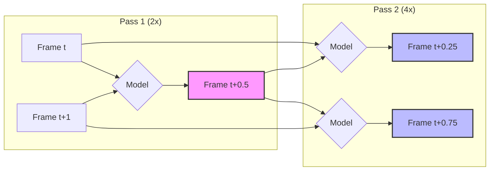
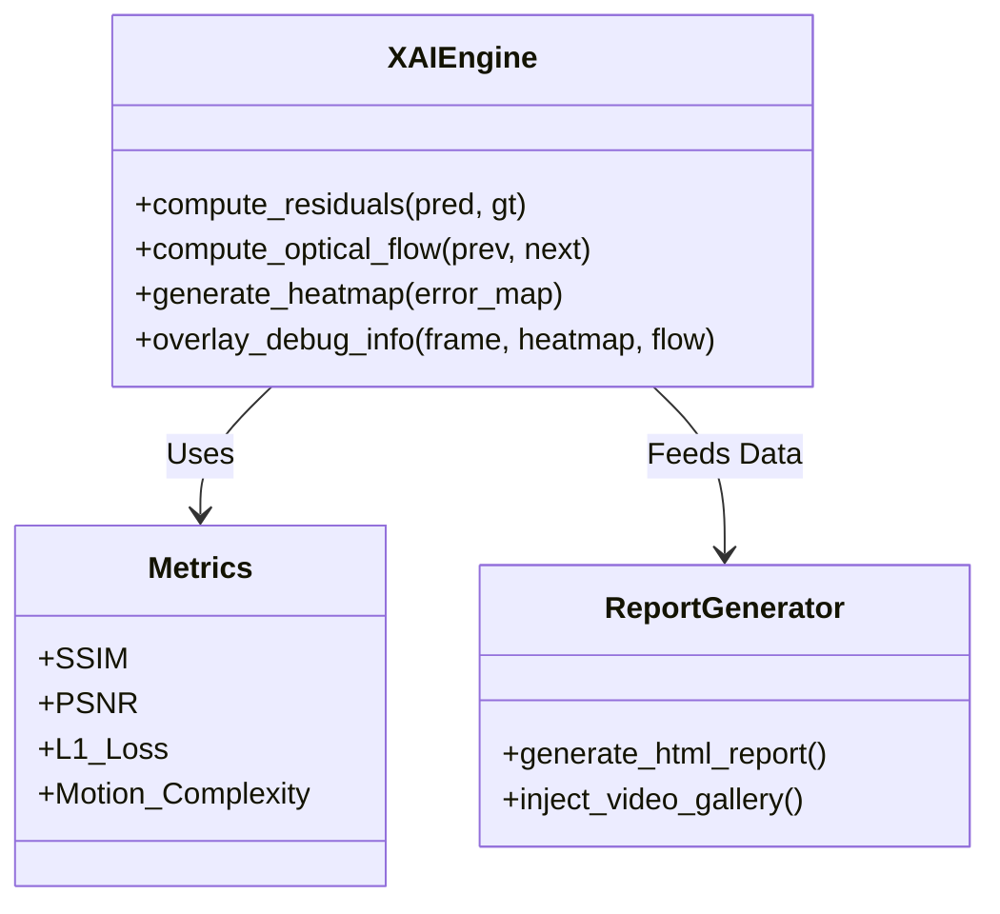

# Towards Explainable Frame Interpolation: Integrating Deep Video Synthesis with Interpretable Reasoning for Robust Visual Enhancement

**(Project Codename: SyntheSight)**

[](https://opensource.org/licenses/MIT)
[](https://www.python.org/downloads/)
[](https://opencv.org/)
[](https://plotly.com/)

> **"Trust, but Verify."** — SyntheSight brings transparency to Deep Video Synthesis.

**SyntheSight** is a research-grade framework designed to evaluate, explain, and enhance Video Frame Interpolation (VFI) models. Unlike standard "black-box" upscalers, SyntheSight integrates a rigorous **"Choppify & Restore"** validation protocol with an **Explainable AI (XAI)** engine, allowing researchers to visualize *where* and *why* interpolation artifacts occur.

---

## 🔬 The Core Concept: "Choppify & Restore"

To scientifically measure restoration quality without relying on subjective "eyeballing," SyntheSight employs a degradation-restoration loop:

1.  **Choppify (Degrade):** We take a high-FPS source video and temporally downsample it (e.g., remove every other frame) to create a "Choppy" ground truth.
2.  **Restore (Interpolate):** The VFI model attempts to reconstruct the missing frames.
3.  **Verify (Explain):** We compare the *Restored* frames against the *Original* frames using pixel-wise metrics (SSIM, PSNR) and generate **XAI Heatmaps** to highlight deviations.

### The Validation Loop



This allows for **Reference-Based Quality Estimation** even when deploying on new data (by using the self-supervised "Choppify" proxy task).

---

## 🏗️ System Architecture

SyntheSight operates on a modular pipeline designed for iterative research.

```mermaid
graph TD
    subgraph "Phase 1: Controlled Degradation"
        A[Original Video<br/>(24/30/60 FPS)] -->|Temporal Downsampling| B[Choppy Video<br/>(10/12/15 FPS)]
        A -.->|Ground Truth Reference| G[Hidden Ground Truth]
    end

    subgraph "Phase 2: Intelligent Restoration"
        B -->|Pass 1: 2x Upscale| C[Restored Video<br/>(20/24/30 FPS)]
        C -->|Pass 2: 2x Upscale| D[Super-Smooth Video<br/>(40/48/60 FPS)]
    end

    subgraph "Phase 3: Explainable Analysis (XAI)"
        C --> E{Analysis Engine}
        D --> E
        G --> E
        
        E -->|Optical Flow| F[Motion Vectors]
        E -->|Residuals| H[Error Heatmaps]
        E -->|Metrics| I[Temporal Consistency]
    end

    subgraph "Phase 4: Reporting"
        F & H & I --> J[Interactive HTML Report]
        J --> K[Video Gallery]
        J --> L[XAI Image Grid]
        J --> M[Quality Graphs]
    end
```

---

## 🚀 Key Features

### 1. Multi-Pass Restoration
SyntheSight supports cascaded interpolation. Run a single pass to restore original fluidity, or multiple passes to achieve **Super-Slow Motion** or **High-Refresh Rate (HFR)** video (e.g., 24fps → 48fps → 96fps).



### 2. The XAI Dashboard
The system generates a standalone `report.html` containing:
*   **Temporal Consistency Graphs:** Track metric stability over time.
*   **XAI Debug Frames:** See exactly what the model "hallucinated" vs. reality.
    *   *Green/Red Heatmaps:* Show intensity of pixel error.
    *   *Flow Overlays:* Visualize predicted motion vectors.
*   **Side-by-Side Video Gallery:** Compare Original, Choppy, and Restored versions instantly.



### 3. Modular Engine
*   **Primary Engine:** Linear Interpolation (Baseline).
*   **Advanced Engine:** FILM (Frame Interpolation for Large Motion) - *TensorFlow required*.
*   **Fallback Mechanism:** Automatically degrades to linear methods if deep learning drivers are unavailable, ensuring the pipeline always completes.

---

## 📦 Installation & Usage

### Prerequisites
*   Python 3.10+
*   FFmpeg (for audio transfer and video encoding)

### Setup
```bash
# Clone the repository
git clone https://github.com/yourusername/synthesight.git
cd synthesight

# Install dependencies
pip install -r requirements.txt
```

### Running an Experiment
The `run_experiment.sh` script automates the entire "Choppify -> Restore -> Analyze" workflow.

```bash
# Make the script executable
chmod +x run_experiment.sh

# Run the full experiment on 'my_video.mp4'
./run_experiment.sh
```

### Custom Usage
You can also run individual modules:

**1. Generate Choppy Data:**
```bash
python generate_choppy_video.py input.mp4 -o choppy.mp4 -f 10
```

**2. Run Interpolation:**
```bash
python main.py choppy.mp4 -o restored.mp4 -r report.json
```

**3. Inject Visuals into Report:**
```bash
python inspect_videos.py --inject-report report.html
```

---

## 📊 Sample Results

| Stage | Description | FPS |
| :--- | :--- | :--- |
| **Original** | The ground truth reference. | 24.0 |
| **Choppy** | Artificially degraded input. | 10.0 |
| **Restored** | The model's reconstruction. | 40.0 |
| **Super-Smooth** | 4x interpolation for HFR displays. | 96.0 |

---

## 📜 Citation

If you use SyntheSight in your research, please cite:

```bibtex
@software{SyntheSight2024,
  author = {Chandramouleeswaran, Arvind Kumar},
  title = {SyntheSight: An Explainable Framework for Video Frame Interpolation},
  year = {2024},
  publisher = {GitHub},
  journal = {GitHub repository},
  howpublished = {\url{https://github.com/arvindkumar1422/synthesight}}
}
```
    *   **Severity Scoring**: Assigns a confidence score to each interpolated frame.
    *   **Natural Language Explanations**: Translates numerical metrics into human-readable diagnostics (e.g., "High occlusion risk detected").
*   **Production Ready**: Features a modular architecture, robust logging via `Rich`, and CLI support for batch processing.

---

## 🚀 Getting Started

### Prerequisites
*   Python 3.8+
*   FFmpeg (for video processing)

### Installation

1.  **Clone the repository**
    ```bash
    git clone https://github.com/arvindkumar1422/Synthesight---A-Frame-Interpolation-and-explanatory-Module.git
    cd Synthesight
    ```

2.  **Install Dependencies**
    ```bash
    pip install -r requirements.txt
    ```

### Usage

Run the main pipeline on your video file:

```bash
python main.py inputs/video.mp4 --output output/smooth.mp4 --report output/report.json
```

**Arguments:**
*   `input_video`: Path to the source video.
*   `-o, --output`: Path for the interpolated video (default: `output.mp4`).
*   `-r, --report`: Path for the JSON analysis report (default: `report.json`).
*   `-c, --config`: Path to custom configuration YAML.

---

## 📊 Methodology

The core innovation of SyntheSight is its **Reference-Free Quality Metric**, defined as:

$$ S_{total} = w_1 \cdot M_c + w_2 \cdot (1 - S_c) + w_3 \cdot |1 - E_r| $$

Where:
*   **$M_c$ (Motion Complexity)**: Average magnitude of optical flow vectors between $I_t$ and $I_{t+1}$. High motion increases the probability of occlusion artifacts.
*   **$S_c$ (Structural Consistency)**: SSIM between the interpolated frame $I_{interp}$ and the linear blend of inputs. Measures deviation from linear motion.
*   **$E_r$ (Edge Preservation Ratio)**: Ratio of edge density in $I_{interp}$ vs. inputs. Detects blurring ($E_r < 1$) or ghosting ($E_r > 1$).

---

## 📂 Project Structure

```
SyntheSight/
├── src/
│   ├── interpolation/   # FILM model wrapper and inference logic
│   ├── detection/       # Computer Vision metrics (Optical Flow, SSIM)
│   ├── explanation/     # Heatmap generation and reporting
│   └── pipeline/        # Orchestrator for video processing
├── main.py              # CLI Entry point
├── config.yaml          # Hyperparameters for detection thresholds
└── requirements.txt     # Python dependencies
```

## 📜 License

This project is licensed under the MIT License.
